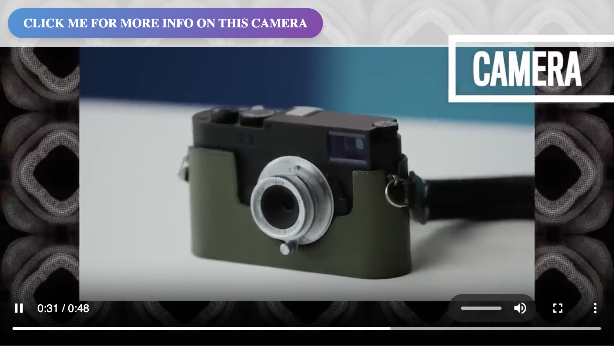

<div align="center">

## KodaStream

### 📺 Interactive video for websites, apps, and smart TVs ✨

Open-source tool for creating immersive and interactive video experiences.
</div>

## 👤 Example use cases
- Interactive live streams
- Shoppable videos
- Clickable product demos

## 🔥 Features
- Time-based metadata: Synchronize video moments with rich user experiences.
- Multi-format: Support for on-demand, live, and simulated live content.
- Cross-platform: Generate interactive video content for the web, desktop, native, and smart TVs.
- REST API: Automate workflows in your preferred programming language.
- Self-hosted: Fully own the deployment.
- Web-based video creation UI (Coming Soon!)

## 🚀 Quick Start
### With Docker
1. Ensure Docker is installed on your machine. 
2. Clone this repo.
3. Create a `videos` directory inside the `backend` folder. Add any videos you want to use here. Two example videos can be found in the `example-videos` directory.
4. Run `make up` from the root of the project. 
5. Call the REST API to create new interactive content.

### Alternativly, without Docker
1. Ensure that FFmpeg and PostgreSQL are installed on your system.
2. Clone this repo.
3. Create a `videos` directory inside the `backend` folder. Add any videos you want to use here. Two example videos can be found in the `example-videos` directory.
4. Navigate to the backend directory.
5. Run `npm install` followed by `npm run start:dev`
6. Call the REST API to create new interactive content.


#### Example Request
This example combines two video clips into a looping live stream. As each clip plays, client-side events containing the metadata are triggered. This metadata is used to build out interactivity, such as clickable links and buy buttons.

**POST** `http://localhost:4000/events`

```json
{
    "loop": true,
    "type": "live",
    "scenes": [
        {
            "location": "videos/clip-1.mp4",
            "metadata": {
                "element-type":"link",
                "link-text": "Click me for more info on this camera",
                "url": "https://en.wikipedia.org/wiki/Instant_camera"
            }
        },
        {
            "location": "videos/clip-2.mp4",
            "metadata": {
                "element-type":"link",
                "link-text": "Click me for more info on this ring",
                "url": "https://en.wikipedia.org/wiki/Native_American_jewelry"
            }
        }
    ]
}
```

#### Playing video
The response of the POST request contains an .m3u8 playlist file in the url field. This file can be loaded into any HLS-compatible player. Each scene's metadata is added as timed metadata. Your HLS player will give you access to this data.

A web-based example of playing a KodaStream interactive video can be found in frontend/demos/simple. Take a look at the KodaPlayer class and its onMetadataChange event to understand more about how client-side interactivity is added.




## 👩‍🏫 Tutorials
Learn how to create an interactive TV channel with our [getting started tutorial](docs/getting-started.md).

## 🤘 In action
#### Sneak in Peace
[Sneakinpeace.com](https://www.sneakinpeace.com/) uses KodaStream to offer a 24/7 live shopping experience. Viewers can watch together, learn more about sneakers, and even purchase items without leaving the stream.
<a href="https://sneakinpeace.com"></a>

#### Interactive job application
A novel approach to job applications, built with KodaStream.
[Watch here](https://job-application-zeta.vercel.app/eleven-labs)

