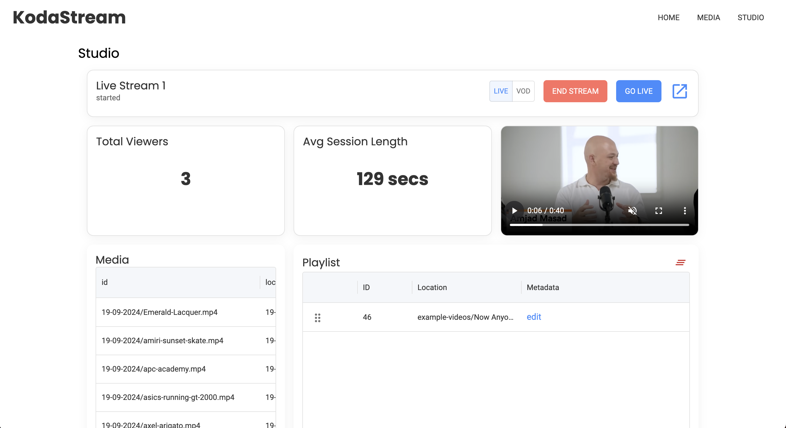

## KodaStream

### 📺 Open-source streaming platform ✨

A headless streaming platform built for monetization.

## 🔥 Features

- **Live streaming**: Broadcast content in real-time.
- **Simulated live**: Stream pre-recorded content as if it were live.
- **Playlist curation**: Create and manage playlists for continuous streaming.
- **VOD (Video on Demand)**: Allow users to watch content on-demand.
- **Timed overlays**: Overlay images, text and CTAs at specific intervals.
- **Stream analytics**: View detailed analytics for your streams.
- **Content scheduling**: Schedule streams to start at specific times.
- **Loop live streams forever**: Keep your stream running without interruptions.
- **User-friendly management UI**: Easy-to-use interface for managing content.
- **HLS broadcasting**: Broadcast over the HLS protocol, ensuring compatibility with most devices.
- **Scalable**: Scales horizontally and vertically to support growing audiences.
- **CDN compatibility**: Works seamlessly with popular content delivery networks (CDNs).
- **REST API**: Full-featured REST API for programmatic access.
- **Chromeless video player**: Customizable video player for brand-specific experiences.

## Example frontend
See how to build your own Netflix style clone. View code [here](https://github.com/james-a-rob/KodaStream/tree/main/samples/hackerflix).

## 🤘 In Action

### Watch and Shop

[Sneakinpeace.com](https://www.sneakinpeace.com/) uses KodaStream to power a 24/7 live shopping experience. Viewers can watch together, learn more about sneakers, and even purchase items without leaving the stream.

## Roadmap

- **Live chat and reactions**: Engage with your audience in real time.
- **Countdown to go live**: Add a countdown before your stream starts.
- **Scheduled start times**: Pre-schedule stream starts at specified times.
- **Additional monetization features**: Including memberships.
- **Prestream image thumbnails**: Add thumbnails before streams go live.
- **Easy embed**: No-code embed streams on any site.
- **Social media share features**: Beautiful shareable posts for social media.
- **Restream to multiple platforms**: Simultaneously broadcast to different platforms.
- **Instream QR codes**: Display QR codes during the stream for promotions or links.

## Prerequisites

Before getting started, ensure you have the following installed and running on your system:

1. **Node.js** (LTS version)
2. **FFmpeg**: Required for video processing.
3. **PostgreSQL**: Database for storing metadata.
4. **Minio**: Object storage (for video files, thumbnails, and streams).

### Setup Minio Buckets
- Create three buckets in Minio:
  - `kodastream-media` (for media files)
  - `kodastream-stream` (for live stream data)
  - `kodastream-thumbnails` (for storing thumbnails)

### PostgreSQL Setup
- Create a local database in PostgreSQL called `kodastream-dev`.

## 🚀 Quick Start

### 1. **Set up the Environment**

Ensure you have all required services running (Node.js, PostgreSQL, Minio and FFmpeg) 

### 2. **Install Dependencies**

Clone the repository and install dependencies:

git clone https://github.com/KodaStream/KodaStream.git
cd KodaStream
npm install

### 3. **Run Database Migrations**

Run the database migrations to set up the necessary schema:

`npm run migrations:run`

### 4. **Start Minio**

Run Minio to create storage buckets:

`minio server /tmp/data`

Ensure Minio is configured with the correct access keys, and that the required buckets (`kodastream-media`, `kodastream-stream`, `kodastream-thumbnails`) exist.

### 5. **Start Backend Server**

Navigate to the backend directory and start the server:

`cd backend`

`npm run start:dev`

This will start the backend server, usually on `http://localhost:4000`.

### 6. **Start Frontend**

Navigate to the frontend directory and start the UI:

`cd frontend`

`npm run dev`

The frontend UI will be available at `http://localhost:5173`.

### 7. **Access the API and UI**

- The **UI** will be accessible at `http://localhost:5173`.
- The **REST API** can be accessed at `http://localhost:4000`.
- The **Content API** is available at `http://localhost:3000`.

You can now interact with the platform via the UI or directly through the API.
